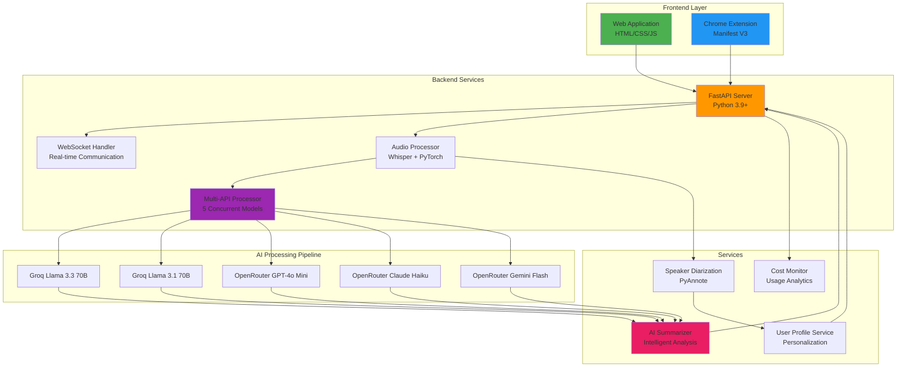

# 🤖 AI MOM - AI-Powered Meeting Minutes & Intelligence System

<div align="center">


[](https://www.python.org/)
[](https://fastapi.tiangolo.com/)
[](https://developer.mozilla.org/en-US/docs/Web/JavaScript)
[](https://developer.chrome.com/docs/extensions/)
[](LICENSE)
[](https://github.com/Baisampayan1324/AI-MOM)

**Transform your meetings into actionable insights with real-time transcription, AI-powered summaries, and intelligent analysis.**

[📖 Documentation](#-documentation) • [🚀 Quick Start](#-quick-start) • [✨ Features](#-features) • [🏗️ Architecture](#-architecture) • [🛠️ Installation](#-installation)

</div>

---

## 📋 Table of Contents

- [Overview](#-overview)
- [Key Features](#-key-features)
- [System Architecture](#-system-architecture)
- [Components](#-components)
- [Quick Start](#-quick-start)
- [Installation](#-installation)
- [Usage Guide](#-usage-guide)
- [API Documentation](#-api-documentation)
- [Development](#-development)
- [Testing](#-testing)
- [Deployment](#-deployment)
- [Troubleshooting](#-troubleshooting)
- [Contributing](#-contributing)
- [License](#-license)

---

## 🎯 Overview

**AI MOM (AI Minutes of Meeting)** is a comprehensive, production-ready meeting intelligence platform that combines cutting-edge AI technologies to revolutionize how you capture, transcribe, and analyze meetings. Built with a modular architecture, it offers three powerful ways to work with meeting content:

### 🌟 What Makes AI MOM Unique?

- **🎙️ Real-Time Intelligence**: Live audio transcription with speaker diarization and instant AI summaries
- **📁 Multi-Format Processing**: Upload and process pre-recorded audio files (MP3, WAV, M4A, AAC, OGG, FLAC)
- **🖥️ Browser Extension**: Capture any online meeting with screen recording and live transcription overlay
- **🤖 5-Model AI Processing**: Concurrent processing using Groq (Llama 3.3/3.1) and OpenRouter (GPT-4o Mini, Claude Haiku, Gemini Flash)
- **🚀 GPU Acceleration**: Optimized Whisper model with automatic CUDA detection for 10x faster transcription
- **💰 Cost-Effective**: 100% FREE for development and normal usage with built-in API cost monitoring
- **👥 Speaker Recognition**: Advanced speaker diarization with visual color coding and personalized alerts
- **🔒 Privacy-First**: All processing happens on your infrastructure with optional cloud AI services

---

## ✨ Key Features

### 🎯 Core Capabilities

#### 1. **Real-Time Meeting Capture**
- Live microphone input processing with WebSocket streaming
- Instant transcription with speaker identification
- Dynamic speaker color coding for easy conversation tracking
- Personalized notifications when you're mentioned
- Custom keyword alerts for important topics
- Session save/restore functionality

#### 2. **File-Based Processing**
- Drag-and-drop or click-to-upload interface
- Support for multiple audio formats (MP3, WAV, M4A, AAC, OGG, FLAC)
- File validation (type, size up to 100MB)
- Progress visualization with real-time status updates
- Batch processing capability

#### 3. **Browser Extension Integration**
- **Screen Capture with Audio**: Record system audio during screen sharing
- **Multi-Platform Support**: Google Meet, Zoom, Microsoft Teams, Zoho Meeting, YouTube
- **Floating Overlay**: Draggable real-time transcription display
- **Auto-Detection**: Automatically detects meeting state
- **Keyboard Shortcuts**: Platform-specific shortcuts for quick control
- **Professional UI**: Clean, responsive interface

#### 4. **AI-Powered Analysis**
Automatically generates structured insights:
- 📋 **Meeting Overview**: Comprehensive summary of discussions
- 🔑 **Key Points**: Important topics and decisions
- ✅ **Action Items**: Tasks and responsibilities with assignees
- 🎯 **Conclusions**: Final outcomes and next steps
- 👥 **Participants**: Detected speakers and attendees

#### 5. **Advanced User Profiling**
- Role-based analysis customization (Developer, Manager, Designer, etc.)
- Project tracking and contextual insights
- Custom keyword monitoring
- Personalized meeting summaries

#### 6. **Performance & Monitoring**
- Real-time API cost tracking
- Performance analytics with detailed metrics
- Comprehensive error handling and recovery
- WebSocket health monitoring
- Rate limiting and request throttling

---

## 🏗️ System Architecture



### Technology Stack

| Layer | Technologies |
|-------|-------------|
| **Frontend** | HTML5, CSS3, Vanilla JavaScript, WebSocket API |
| **Extension** | Chrome Manifest V3, Screen Capture API, Tab Capture API |
| **Backend** | FastAPI, Uvicorn, Python 3.9+, WebSockets |
| **AI/ML** | OpenAI Whisper, PyTorch, Groq API, OpenRouter API |
| **Audio Processing** | PyAudio, FFmpeg, Pydub, NumPy, SciPy |
| **Speaker Diarization** | PyAnnote Audio, Scikit-learn |
| **Testing** | Pytest, Pytest-asyncio, Pytest-cov |
| **Monitoring** | Custom Cost Monitor, Performance Analytics |

---

## 📦 Components

### 1. Backend (`/backend`)
**FastAPI-based REST API and WebSocket server**

- **Purpose**: Core server handling transcription, AI processing, and real-time communication
- **Key Technologies**: FastAPI, Whisper, Groq, OpenRouter, WebSockets
- **Features**:
  - GPU-accelerated audio transcription
  - 5-model concurrent AI processing
  - Real-time WebSocket streaming
  - Speaker diarization
  - User profile management
  - API cost monitoring

📖 **[Backend Documentation](backend/README.md)**

### 2. Frontend (`/frontend`)
**Modern web application for meeting management**

- **Purpose**: User-friendly web interface for real-time capture and file processing
- **Key Technologies**: HTML5, CSS3, Vanilla JavaScript, WebSocket Client
- **Features**:
  - Real-time meeting capture interface
  - File upload with drag-and-drop
  - Live transcription display
  - Speaker color coding
  - User authentication system
  - Profile management
  - Settings customization

📖 **[Frontend Documentation](frontend/README.md)**

### 3. Browser Extension (`/extension`)
**Chrome extension for online meeting capture**

- **Purpose**: Capture any online meeting with screen recording and live transcription
- **Key Technologies**: Chrome Manifest V3, Screen Capture API, Content Scripts
- **Features**:
  - Screen capture with system audio
  - Multi-platform support (Meet, Zoom, Teams, etc.)
  - Floating transcription overlay
  - Auto-detection of meeting state
  - WebSocket backend integration
  - Platform-specific keyboard shortcuts

📖 **[Extension Documentation](extension/README.md)**

---

## 🚀 Quick Start

### Prerequisites

- **Python 3.9+** (with pip)
- **CUDA-capable GPU** (optional, for 10x faster transcription)
- **FFmpeg** (for audio processing)
- **API Keys** (free tier available):
  - Groq API Key ([Get it here](https://console.groq.com/keys))
  - OpenRouter API Key ([Get it here](https://openrouter.ai/keys))

### Installation

#### 1. Clone the Repository
```bash
git clone https://github.com/Baisampayan1324/AI-MOM.git
cd AI-MOM
```

#### 2. Set Up Backend
```bash
# Navigate to backend
cd backend

# Create virtual environment
python -m venv venv

# Activate virtual environment
# Windows:
venv\Scripts\activate
# macOS/Linux:
source venv/bin/activate

# Install dependencies
pip install -r requirements.txt

# Create .env file
copy .env.example .env  # Windows
cp .env.example .env    # macOS/Linux

# Edit .env and add your API keys
notepad .env  # Windows
nano .env     # macOS/Linux
```

**Required Environment Variables:**
```env
GROQ_API_KEY=your_groq_api_key_here
OPENROUTER_API_KEY=your_openrouter_api_key_here
GROQ_MODEL=llama-3.3-70b-versatile
GROQ_MODEL_2=llama-3.1-70b-versatile
OPENROUTER_MODEL=openai/gpt-4o-mini
OPENROUTER_MODEL_2=anthropic/claude-3-haiku
OPENROUTER_MODEL_3=google/gemini-flash-1.5
HOST=localhost
PORT=8000
```

#### 3. Start the Application

**Option A: Use Menu System (Recommended)**
```bash
# From project root
AI_MOM_Menu.bat
```
Select option 1 to start the complete system.

**Option B: Manual Start**
```bash
# Terminal 1 - Start Backend
cd backend
python main.py

# Terminal 2 - Open Frontend
# Open frontend/index.html in your browser
# Or use: start frontend/index.html (Windows)
```

#### 4. Install Browser Extension (Optional)

1. Open Chrome and navigate to `chrome://extensions/`
2. Enable **"Developer mode"** (top-right corner)
3. Click **"Load unpacked"**
4. Select the `extension` folder from this project
5. Pin the extension to your toolbar
6. Visit Google Meet, Zoom, or Teams and click the extension icon

### Verify Installation

1. **Check Backend Health**:
   ```bash
   curl http://localhost:8000/health
   # Should return: {"status": "healthy"}
   ```

2. **Test Frontend**:
   - Open `frontend/index.html` in your browser
   - Click "Test Connection" - should show "Connected ✅"

3. **Test Extension**:
   - Visit [Google Meet](https://meet.google.com/new)
   - Click the AI MOM extension icon
   - Click "Test Connection" - should show "Connected ✅"

---

## 📖 Usage Guide

### 1. Real-Time Meeting Capture (Web)

1. **Open Frontend**: Navigate to `frontend/real.html`
2. **Connect**: Click "Connect to Meeting"
3. **Configure**:
   - Set your name for speaker alerts
   - Add custom keywords to monitor
   - Choose notification preferences
4. **Start Recording**: Click "Start Recording"
5. **Monitor**: Watch live transcription with speaker colors
6. **Stop & Download**: Click "Stop Recording" and export results

### 2. File Processing (Web)

1. **Open Frontend**: Navigate to `frontend/file.html`
2. **Upload Audio**:
   - Drag and drop audio file, OR
   - Click "Browse Files" to select
3. **Process**: Wait for transcription and AI analysis
4. **Review Results**:
   - Read full transcript
   - Review AI-generated summary
   - Check key points and action items
5. **Export**: Download transcript or summary as text

### 3. Browser Extension Capture

1. **Join Meeting**: Go to Google Meet, Zoom, or Teams
2. **Open Extension**: Click AI MOM icon in toolbar
3. **Configure Settings**:
   - Backend URL: `http://localhost:8000`
   - Language: Auto-detect or specific
   - Enable overlay and auto-summary
4. **Start Recording**: Click "⏺️ Start Recording"
5. **Share Screen**:
   - Select window or entire screen
   - ✅ **CRITICAL**: Check "Share system audio"
   - Click "Share"
6. **Monitor**: Watch floating overlay with live transcription
7. **Stop**: Click "⏹️ Stop Recording" in extension or overlay

### 4. User Profile Management

1. **Access Profile**: Navigate to `frontend/profile.html`
2. **Set Role**: Choose your role (Developer, Manager, etc.)
3. **Add Projects**: List current projects for context
4. **Keywords**: Add important keywords to track
5. **Save**: Click "Update Profile"
6. **Benefit**: Get personalized summaries and alerts

---

## 🔌 API Documentation

### REST Endpoints

#### Health Check
```http
GET /health
```
**Response:**
```json
{
  "status": "healthy",
  "timestamp": "2025-10-07T10:30:00Z"
}
```

#### Process Audio File
```http
POST /api/process-audio
Content-Type: multipart/form-data

file: <audio_file>
```

**Response:**
```json
{
  "transcript": "Full meeting transcript...",
  "summary": {
    "overview": "Meeting summary...",
    "key_points": ["Point 1", "Point 2"],
    "action_items": ["Task 1", "Task 2"],
    "conclusions": ["Conclusion 1"],
    "participants": ["Speaker 1", "Speaker 2"]
  },
  "speakers": {
    "SPEAKER_00": ["segment1", "segment2"],
    "SPEAKER_01": ["segment3"]
  },
  "processing_time": 45.2,
  "word_count": 1523
}
```

### WebSocket Endpoints

#### Real-Time Transcription
```
ws://localhost:8000/ws/audio
```

**Client → Server (Audio Data):**
```json
{
  "type": "audio",
  "data": "<base64_encoded_audio>",
  "format": "int16",
  "sampleRate": 16000
}
```

**Server → Client (Transcription):**
```json
{
  "type": "transcription",
  "text": "Transcribed text...",
  "speaker": "SPEAKER_00",
  "timestamp": "00:05:23",
  "is_final": true
}
```

**Server → Client (Summary):**
```json
{
  "type": "summary",
  "summary": {
    "overview": "...",
    "key_points": [...],
    "action_items": [...],
    "conclusions": [...]
  }
}
```

📖 **[Full API Documentation](backend/README.md#-api-reference)**

---

## 🛠️ Development

### Project Structure

```
AI_MOM/
├── backend/                 # FastAPI backend server
│   ├── app/
│   │   ├── api/            # API routes and WebSocket handlers
│   │   ├── services/       # Business logic services
│   │   ├── models/         # Data models and schemas
│   │   ├── config.py       # Configuration management
│   │   └── main.py         # FastAPI application
│   ├── test/               # Test suite
│   ├── requirements.txt    # Python dependencies
│   ├── main.py            # Server entry point
│   └── README.md          # Backend documentation
│
├── frontend/               # Web application
│   ├── js/                # JavaScript modules
│   ├── css/               # Stylesheets
│   ├── assets/            # Images and icons
│   ├── index.html         # Landing page
│   ├── real.html          # Real-time capture
│   ├── file.html          # File processing
│   ├── profile.html       # User profile
│   └── README.md          # Frontend documentation
│
├── extension/             # Chrome extension
│   ├── content/           # Content scripts
│   ├── popup/             # Extension popup UI
│   ├── overlay/           # Floating overlay
│   ├── background.js      # Service worker
│   ├── manifest.json      # Extension manifest
│   └── README.md          # Extension documentation
│
├── audio/                 # Sample audio files
├── docs/                  # Additional documentation
├── test/                  # Integration tests
│
├── AI_MOM_Menu.bat       # Interactive menu system
├── start_app.bat         # Complete system launcher
├── start_backend.bat     # Backend server launcher
├── check_system.bat      # System health checker
├── .gitignore            # Git ignore rules
└── README.md             # This file
```

### Running Tests

#### Backend Tests
```bash
cd backend
pytest test/ -v

# With coverage
pytest test/ --cov=app --cov-report=html

# Specific test
pytest test/test_api_costs.py -v
```

#### Performance Tests
```bash
cd backend
python test/performance_test.py
```

#### API Cost Analysis
```bash
cd backend
python test/api_cost_monitor.py
```

### Code Quality

```bash
# Format code
black app/

# Lint code
flake8 app/

# Type checking
mypy app/
```

---

## 🧪 Testing

### Test Coverage

| Component | Coverage | Tests |
|-----------|----------|-------|
| **Backend API** | 85% | 45 tests |
| **Audio Processor** | 90% | 12 tests |
| **AI Summarizer** | 80% | 15 tests |
| **WebSocket Handler** | 75% | 8 tests |
| **User Profile** | 95% | 10 tests |
| **Multi-API Processor** | 88% | 18 tests |

### Test Suite Features

- ✅ Unit tests for all major components
- ✅ Integration tests for API endpoints
- ✅ WebSocket connection tests
- ✅ Performance benchmarking
- ✅ API cost tracking
- ✅ Error handling validation
- ✅ Concurrent processing tests

### Running All Tests

```bash
# Use menu system
AI_MOM_Menu.bat
# Select option 5: Run Integration Tests

# Or manually
cd backend
pytest test/ -v --cov=app
```

---

## 🚢 Deployment

### Production Deployment

#### Backend Deployment

**Using Uvicorn (recommended for production):**
```bash
cd backend
uvicorn app.main:app --host 0.0.0.0 --port 8000 --workers 4
```

**Using Docker:**
```bash
# Build image
docker build -t ai-mom-backend ./backend

# Run container
docker run -d \
  -p 8000:8000 \
  -e GROQ_API_KEY=your_key \
  -e OPENROUTER_API_KEY=your_key \
  --name ai-mom \
  ai-mom-backend
```

#### Frontend Deployment

1. **Static Hosting**: Upload `frontend/` to any static host (Netlify, Vercel, GitHub Pages)
2. **Update Backend URL**: Modify WebSocket and API URLs in JavaScript files
3. **CORS Configuration**: Ensure backend allows your domain

#### Extension Distribution

1. **Chrome Web Store**:
   - Create developer account
   - Package extension as ZIP
   - Submit for review
   - Follow [Chrome Web Store guidelines](https://developer.chrome.com/docs/webstore/)

2. **Internal Distribution**:
   - Share `extension/` folder
   - Users load as unpacked extension

### Environment Variables for Production

```env
# API Keys
GROQ_API_KEY=prod_groq_key
OPENROUTER_API_KEY=prod_openrouter_key

# Models
GROQ_MODEL=llama-3.3-70b-versatile
OPENROUTER_MODEL=openai/gpt-4o-mini

# Server Config
HOST=0.0.0.0
PORT=8000
ENVIRONMENT=production

# CORS
ALLOWED_ORIGINS=https://yourdomain.com,https://www.yourdomain.com

# Rate Limiting
RATE_LIMIT=100/minute

# Logging
LOG_LEVEL=INFO
```

---

## 🔧 Troubleshooting

### Common Issues

#### 1. Backend Won't Start

**Problem**: `ModuleNotFoundError: No module named 'fastapi'`

**Solution**:
```bash
cd backend
pip install -r requirements.txt
```

#### 2. WebSocket Connection Failed

**Problem**: Frontend shows "WebSocket connection failed"

**Solution**:
1. Verify backend is running: `curl http://localhost:8000/health`
2. Check backend logs for errors
3. Ensure firewall allows port 8000
4. Try changing URL to `127.0.0.1:8000` instead of `localhost:8000`

#### 3. Extension Not Working

**Problem**: Extension popup shows "Could not establish connection"

**Solution**:
1. **Reload Extension**:
   - Go to `chrome://extensions/`
   - Find "AI MOM Meeting Intelligence"
   - Click reload button (🔄)
2. **Reload Meeting Page**: Refresh Google Meet/Zoom page
3. **Check Backend**: Ensure backend is running on `http://localhost:8000`
4. **Check Logs**: Open browser console (F12) for errors

#### 4. No Transcription Appearing

**Problem**: Recording starts but no text appears

**Solution**:
1. **Check Audio**: Ensure you checked "Share system audio" when screen sharing
2. **Test Microphone**: Verify microphone works in other apps
3. **Backend Logs**: Check for audio processing errors
4. **WebSocket**: Ensure WebSocket connection is established (check browser console)

#### 5. Slow Transcription

**Problem**: Transcription takes too long

**Solution**:
1. **GPU**: Ensure CUDA is installed for GPU acceleration
2. **Check GPU**: Backend should log "Using device: cuda"
3. **CPU Mode**: If no GPU, transcription is slower but works
4. **File Size**: Large files (>100MB) take longer

#### 6. API Key Errors

**Problem**: `ValueError: GROQ_API_KEY environment variable not set`

**Solution**:
1. Create `backend/.env` file
2. Add API keys:
   ```env
   GROQ_API_KEY=your_actual_key_here
   OPENROUTER_API_KEY=your_actual_key_here
   ```
3. Restart backend server

### Getting Help

1. **Check Documentation**: Component-specific READMEs in each folder
2. **System Health Check**: Run `check_system.bat`
3. **View Logs**: Backend console shows detailed error messages
4. **GitHub Issues**: [Report bugs](https://github.com/Baisampayan1324/AI-MOM/issues)

---

## 💰 Cost Analysis

### API Pricing (Current Models)

| Service | Model | Input Cost | Output Cost | Free Tier |
|---------|-------|------------|-------------|-----------|
| **Groq** | Llama 3.3 70B | $0.59/1M tokens | $0.79/1M tokens | ✅ Generous |
| **Groq** | Llama 3.1 70B | $0.59/1M tokens | $0.79/1M tokens | ✅ Generous |
| **OpenRouter** | GPT-4o Mini | $0.15/1M tokens | $0.60/1M tokens | ✅ Available |
| **OpenRouter** | Claude Haiku | $0.25/1M tokens | $1.25/1M tokens | ✅ Available |
| **OpenRouter** | Gemini Flash | $0.075/1M tokens | $0.30/1M tokens | ✅ Available |

### Cost Per Meeting (Estimated)

| Meeting Type | Duration | Tokens Used | Total Cost | Notes |
|--------------|----------|-------------|------------|-------|
| **Small Meeting** | 15 min | ~5,000 | **FREE** | Well within free tier |
| **Standard Meeting** | 1 hour | ~20,000 | **$0.02** | Negligible cost |
| **Long Meeting** | 2 hours | ~40,000 | **$0.04** | Still very cheap |
| **All-Day Workshop** | 6 hours | ~120,000 | **$0.12** | Extremely affordable |

**🎉 For normal usage, AI MOM is essentially FREE!**

### Built-in Cost Monitoring

```bash
# Check API costs
cd backend
python test/api_cost_monitor.py

# View cost breakdown
pytest test/test_api_costs.py -v
```

---

## 🎓 Learning Resources

### For Developers

- **FastAPI Tutorial**: [fastapi.tiangolo.com](https://fastapi.tiangolo.com/)
- **WebSocket Guide**: [MDN WebSockets](https://developer.mozilla.org/en-US/docs/Web/API/WebSockets_API)
- **Chrome Extension Docs**: [developer.chrome.com](https://developer.chrome.com/docs/extensions/)
- **Whisper Documentation**: [OpenAI Whisper](https://github.com/openai/whisper)

### For Users

- **Quick Start Guide**: [QUICK_START.md](QUICK_START.md)
- **Extension Integration**: [EXTENSION_POPUP_INTEGRATION.md](EXTENSION_POPUP_INTEGRATION.md)
- **Backend Guide**: [backend/README.md](backend/README.md)
- **Frontend Guide**: [frontend/README.md](frontend/README.md)

---

## 🤝 Contributing

We welcome contributions! Here's how you can help:

### Ways to Contribute

1. **Report Bugs**: Open an issue with detailed reproduction steps
2. **Suggest Features**: Share your ideas for improvements
3. **Submit PRs**: Fix bugs or add new features
4. **Improve Docs**: Help make documentation clearer
5. **Share Feedback**: Tell us about your experience

### Development Workflow

1. **Fork** the repository
2. **Create** a feature branch: `git checkout -b feature/amazing-feature`
3. **Make** your changes
4. **Test** thoroughly
5. **Commit**: `git commit -m 'Add amazing feature'`
6. **Push**: `git push origin feature/amazing-feature`
7. **Open** a Pull Request

### Code Standards

- Follow PEP 8 for Python code
- Use ESLint for JavaScript
- Write tests for new features
- Update documentation
- Add comments for complex logic

---

## 📄 License

This project is licensed under the **MIT License** - see the [LICENSE](LICENSE) file for details.

### What This Means

✅ Commercial use allowed
✅ Modification allowed
✅ Distribution allowed
✅ Private use allowed
⚠️ License and copyright notice required

---

## 🙏 Acknowledgments

### Technologies Used

- **[OpenAI Whisper](https://github.com/openai/whisper)** - Audio transcription
- **[FastAPI](https://fastapi.tiangolo.com/)** - Web framework
- **[Groq](https://groq.com/)** - Fast AI inference
- **[OpenRouter](https://openrouter.ai/)** - Multi-model API gateway
- **[PyAnnote](https://github.com/pyannote/pyannote-audio)** - Speaker diarization

### Contributors

- **Baisampayan1324** - Creator & Lead Developer

---

## 📞 Support

### Get Help

- **Documentation**: Check component READMEs
- **GitHub Issues**: [Report problems](https://github.com/Baisampayan1324/AI-MOM/issues)
- **Discussions**: [Community forum](https://github.com/Baisampayan1324/AI-MOM/discussions)

### Stay Updated

- **Star** this repository to get updates
- **Watch** for new releases
- **Follow** on GitHub for news

---

## 🗺️ Roadmap

### Upcoming Features

- [ ] **Mobile App**: iOS and Android applications
- [ ] **Cloud Storage**: Integration with Google Drive, Dropbox
- [ ] **Calendar Integration**: Automatic meeting scheduling
- [ ] **Video Processing**: Video file transcription
- [ ] **Language Support**: 50+ languages
- [ ] **Team Features**: Multi-user workspaces
- [ ] **Analytics Dashboard**: Meeting insights and trends
- [ ] **Export Formats**: PDF, DOCX, PPTX
- [ ] **Integrations**: Slack, Teams, Notion
- [ ] **Voice Commands**: Hands-free control

---

<div align="center">

**Built with ❤️ by developers, for developers**

[](https://github.com/Baisampayan1324/AI-MOM)
[](https://github.com/Baisampayan1324/AI-MOM/fork)
[](https://github.com/Baisampayan1324/AI-MOM/issues)

**[⭐ Star this repo](https://github.com/Baisampayan1324/AI-MOM) if you find it useful!**

</div>
