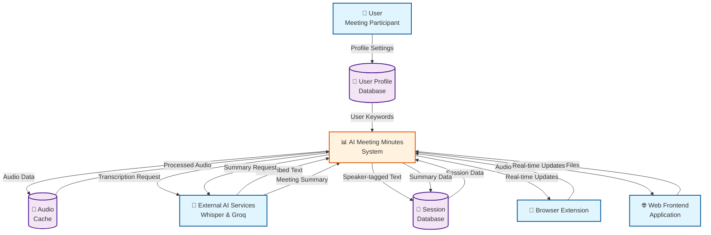
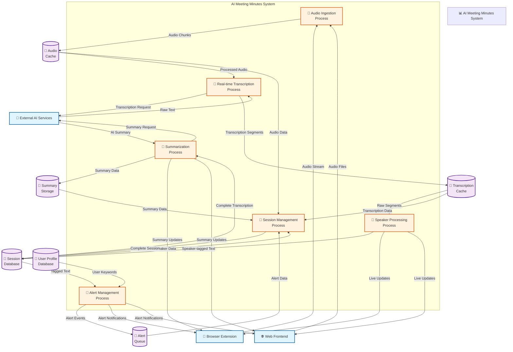

# AI Meeting Minutes - Data Flow Diagram (Level 0)

## Data Flow Diagram (Level 1) - Process Decomposition

## Data Flow Descriptions

### Level 0 Processes
1. **Audio Input Flow**: Users provide audio through browser extension (real-time) or web frontend (file upload)
2. **Processing Flow**: Audio chunks are transcribed, speakers identified, and text formatted
3. **Real-time Communication**: Live updates sent to connected clients via WebSocket
4. **Alert Flow**: System monitors for user mentions and triggers notifications
5. **Summarization Flow**: Complete transcriptions are analyzed to generate meeting summaries
6. **Profile Management**: User preferences and keywords stored for personalization

### Level 1 Subprocesses

#### Audio Ingestion Process
- **Input**: Raw audio streams or uploaded files
- **Processing**: Format validation, chunking (5-second segments), compression
- **Output**: Standardized audio chunks ready for transcription
- **Data Store**: Audio Cache (temporary storage)

#### Real-time Transcription Process
- **Input**: Audio chunks with meeting context
- **Processing**: API calls to Whisper, response parsing, timestamp addition
- **Output**: Raw transcribed text segments with timing
- **External**: Groq Whisper API
- **Data Store**: Transcription Cache

#### Speaker Processing Process
- **Input**: Raw transcription segments and audio data
- **Processing**: Voice pattern analysis, speaker clustering, color assignment
- **Output**: Speaker-tagged transcription with visual formatting
- **Data Store**: Session Database (speaker profiles)

#### Alert Management Process
- **Input**: Speaker-tagged text and user profile keywords
- **Processing**: Keyword matching, mention detection, alert prioritization
- **Output**: Alert events with context and trigger information
- **Data Store**: Alert Queue

#### Summarization Process
- **Input**: Complete meeting transcription
- **Processing**: LLM analysis, key point extraction, action item identification
- **Output**: Structured meeting summary with insights
- **External**: Groq LLM API
- **Data Store**: Summary Storage

#### Session Management Process
- **Input**: All processed meeting data
- **Processing**: Data aggregation, statistics calculation, persistence
- **Output**: Complete archived meeting session
- **Data Store**: Session Database (permanent storage)