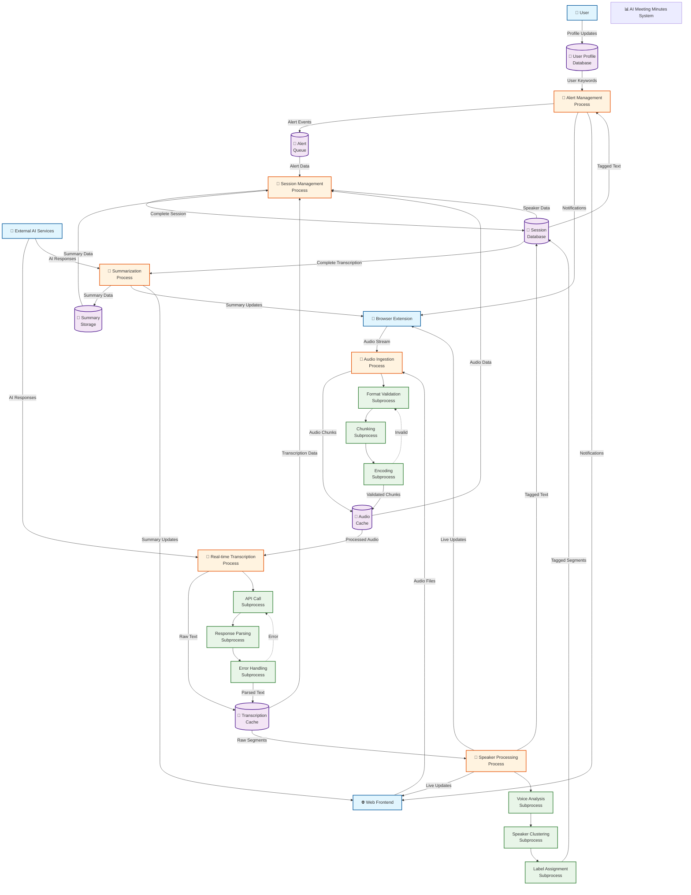

# AI Meeting Minutes - Detailed Data Flow Diagram (Level 2)

## Detailed Data Flow Analysis

### Level 0 Context Diagram
The highest level view showing the system boundary and external entities.

### Level 1 Process Decomposition
Breaking down the main system into six primary subprocesses:

#### 1. Audio Ingestion Process
**Purpose**: Handle incoming audio from multiple sources
**Decomposition**:
- **Format Validation**: Check audio format, sample rate, channels
- **Chunking**: Split audio into 5-second segments for real-time processing
- **Encoding**: Compress and format audio for transmission

**Data Flows**:
- Input: Raw audio streams/files
- Output: Standardized audio chunks
- Data Store: Audio Cache (temporary)

#### 2. Real-time Transcription Process
**Purpose**: Convert audio to text using AI services
**Decomposition**:
- **API Call**: Send audio chunks to Whisper API
- **Response Parsing**: Extract text, timestamps, confidence scores
- **Error Handling**: Retry failed requests, fallback processing

**Data Flows**:
- Input: Audio chunks + meeting context
- Output: Transcribed text segments
- External: Groq Whisper API
- Data Store: Transcription Cache

#### 3. Speaker Processing Process
**Purpose**: Identify and label different speakers
**Decomposition**:
- **Voice Analysis**: Extract voice features and patterns
- **Speaker Clustering**: Group similar voice segments
- **Label Assignment**: Assign colors and names to speakers

**Data Flows**:
- Input: Raw transcription segments + audio data
- Output: Speaker-tagged transcription
- Data Store: Session Database (speaker profiles)

#### 4. Alert Management Process
**Purpose**: Monitor transcription for user notifications
**Decomposition**:
- **Keyword Matching**: Check against user-defined keywords
- **Mention Detection**: Identify personal references
- **Priority Assignment**: Classify alert types and urgency

**Data Flows**:
- Input: Speaker-tagged text + user profile keywords
- Output: Alert events with context
- Data Store: Alert Queue

#### 5. Summarization Process
**Purpose**: Generate AI-powered meeting insights
**Decomposition**:
- **Content Aggregation**: Compile complete transcription
- **AI Analysis**: Send to LLM for intelligent summarization
- **Structure Extraction**: Parse key points and action items

**Data Flows**:
- Input: Complete meeting transcription
- Output: Structured meeting summary
- External: Groq LLM API
- Data Store: Summary Storage

#### 6. Session Management Process
**Purpose**: Persist and organize meeting data
**Decomposition**:
- **Data Aggregation**: Collect all processed meeting data
- **Statistics Calculation**: Generate speaking time, participation metrics
- **Archive Creation**: Save complete session for future access

**Data Flows**:
- Input: All subprocess outputs
- Output: Complete archived meeting session
- Data Store: Session Database (permanent)

### Data Flow Types

#### Primary Data Flows
- **Audio Flow**: Raw audio → Processed chunks → Transcription → Speaker tagging
- **Text Flow**: Transcribed text → Speaker identification → Alert processing → Summarization
- **Control Flow**: User settings → Alert configuration → Notification triggers

#### Real-time Data Flows
- **WebSocket Updates**: Live transcription segments to connected clients
- **Alert Notifications**: Immediate notifications for important events
- **Progress Updates**: Processing status and audio level indicators

#### Persistence Flows
- **Session Data**: All meeting data saved to database
- **User Profiles**: Personalization settings and preferences
- **Historical Data**: Past meetings and summaries for reference

### Trust Boundaries & Security

#### External Interfaces
- **User Input**: Profile data, audio uploads (untrusted)
- **Browser Extension**: Audio capture, UI injection (semi-trusted)
- **Web Frontend**: File uploads, user interactions (untrusted)
- **External APIs**: AI services, transcription (external)

#### Internal Processing
- **Data Validation**: Input sanitization at all entry points
- **Access Control**: User authentication and authorization
- **Audit Logging**: Track all data processing activities

### Error Handling & Recovery

#### Process-Level Error Handling
- **Audio Processing**: Format conversion failures, corrupted files
- **API Failures**: Network timeouts, service unavailability
- **Data Corruption**: Invalid transcription results, parsing errors

#### Recovery Mechanisms
- **Retry Logic**: Automatic retries for transient failures
- **Fallback Processing**: Local processing when API unavailable
- **Data Recovery**: Session restoration from partial data
- **User Notification**: Clear error messages and recovery options

### Performance Considerations

#### Real-time Requirements
- **Latency**: <500ms for transcription processing
- **Throughput**: Handle multiple concurrent meetings
- **Scalability**: Support growing user base and meeting volume

#### Data Management
- **Caching Strategy**: Temporary storage for active sessions
- **Archive Policy**: Long-term storage with compression
- **Cleanup Procedures**: Automatic removal of temporary data