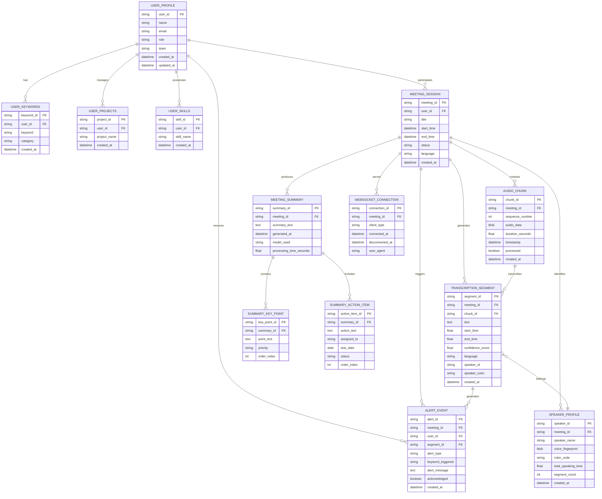

# AI Meeting Minutes - Entity-Relationship Diagram

## Entity Descriptions

### Core Entities

#### User_Profile
Represents a system user with their personal and professional information
- **Attributes**: Basic info, role, team, timestamps
- **Relationships**: Has keywords, projects, skills; participates in meetings; receives alerts

#### Meeting_Session
Represents a single meeting recording session
- **Attributes**: Session metadata, timing, status, language
- **Relationships**: Contains audio chunks, generates transcriptions, identifies speakers, triggers alerts, produces summaries

### Data Processing Entities

#### Audio_Chunk
Represents individual audio segments processed by the system
- **Attributes**: Binary audio data, timing, sequence info
- **Relationships**: Belongs to meeting, produces transcription segments

#### Transcription_Segment
Represents transcribed text segments with timing and speaker info
- **Attributes**: Text content, timing, confidence, speaker assignment
- **Relationships**: Belongs to meeting/chunk, belongs to speaker, generates alerts

#### Speaker_Profile
Represents identified speakers in a meeting
- **Attributes**: Speaker info, voice data, visual formatting, statistics
- **Relationships**: Belongs to meeting, has multiple transcription segments

### Notification & Summary Entities

#### Alert_Event
Represents notifications triggered during transcription
- **Attributes**: Alert type, trigger info, message, acknowledgment status
- **Relationships**: Belongs to meeting/user/segment

#### Meeting_Summary
Represents AI-generated meeting summaries
- **Attributes**: Summary text, generation metadata, processing time
- **Relationships**: Belongs to meeting, contains key points and action items

#### Summary_Key_Point & Summary_Action_Item
Represent structured summary components
- **Attributes**: Content, priority/order, assignment (for actions)
- **Relationships**: Belong to meeting summary

### Supporting Entities

#### User_Keywords, User_Projects, User_Skills
Represent user-specific customization data for personalization
- **Attributes**: Specific data plus user association
- **Relationships**: Belong to user profile

#### WebSocket_Connection
Represents real-time client connections for live updates
- **Attributes**: Connection metadata, client type, timing
- **Relationships**: Serves meeting sessions

## Relationship Cardinalities

- **User_Profile ||--o{ Meeting_Session**: One user can have many meeting sessions
- **Meeting_Session ||--o{ Audio_Chunk**: One meeting contains many audio chunks
- **Audio_Chunk ||--o{ Transcription_Segment**: One chunk produces one segment
- **Transcription_Segment }o--|| Speaker_Profile**: Many segments belong to one speaker
- **Meeting_Session ||--o{ Alert_Event**: One meeting can trigger many alerts
- **Meeting_Session ||--o{ Meeting_Summary**: One meeting produces one summary
- **Meeting_Summary ||--o{ Summary_Key_Point**: One summary has many key points
- **Meeting_Summary ||--o{ Summary_Action_Item**: One summary has many action items