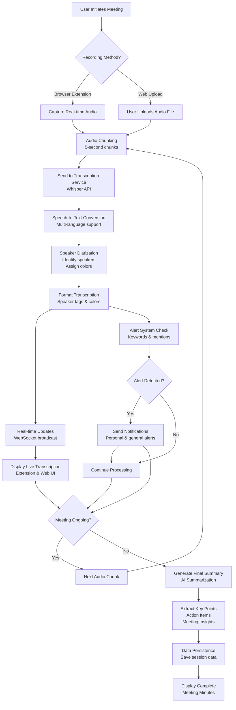

# AI Meeting Minutes - System Flowchart

## Process Description

1. **Audio Input**: Users can start recording via browser extension or upload pre-recorded files
2. **Chunking**: Audio is split into 5-second chunks for real-time processing
3. **Transcription**: Each chunk is sent to Whisper API for speech-to-text conversion
4. **Speaker Identification**: AI identifies different speakers and assigns color coding
5. **Real-time Display**: Live transcription updates are sent via WebSocket to UI
6. **Alert System**: Monitors for user mentions, questions, and custom keywords
7. **Summarization**: When meeting ends, AI generates comprehensive summary with key points and action items
8. **Persistence**: All data is saved for future reference